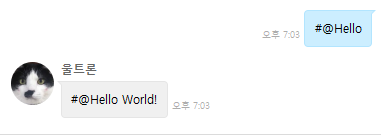

# spring-boot-starter-chatbot-example

*https://github.com/kingbbode/spring-boot-starter-chatbot 의 Example Project*

> com.kingbbode.brain.HelloWorldBrain.java

```java
@Brain
public class HelloWorldBrain {
    @BrainCell(key = "Hello", explain = "시작 샘플", example = "#Hello", function = "hello")
    public String vacationY(BrainRequest brainRequest) {
        return brainRequest.getContent() + " World!";
    }
}
```

